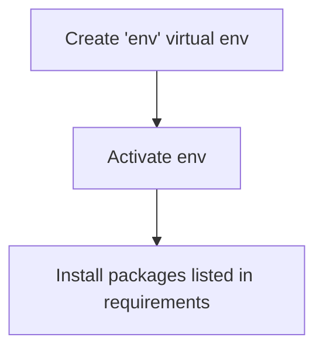
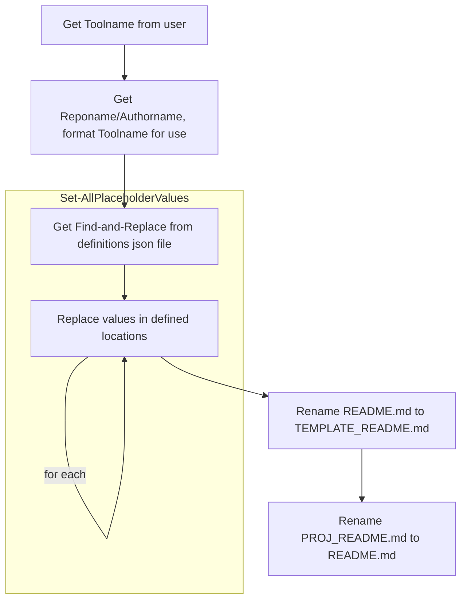

# Task Automation

## Initialize-PyVirtualEnv.ps1

```mermaid
graph TB
    venv[Create 'env' virtual env]-->activate[Activate env]-->reqs[Install packages listed in requirements]
```

## Initialize-ToolTemplate.ps1

```mermaid
graph TB
    Get-ToolName[Get Toolname from user]-->Format-ToolName[Get Reponame/Authorname, format Toolname for use]-->Get-Definitions
    subgraph Set-AllPlaceholderValues
        direction LR
        Get-Definitions[Get Find-and-Replace from definitions json file]-->Set-PlaceholderValue[Replace values in defined locations]--for each-->Set-PlaceholderValue
    end
    Set-PlaceholderValue-->D[Rename README.md to TEMPLATE_README.md]-->E[Rename PROJ_README.md to README.md]
```