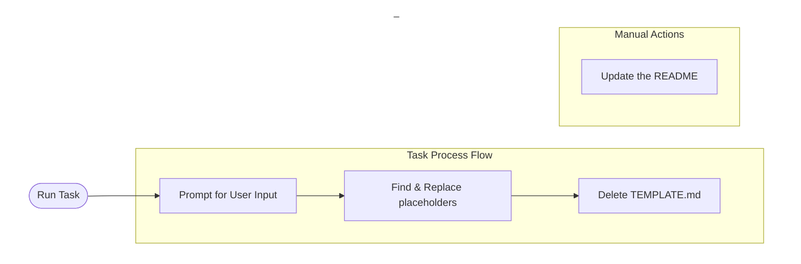

# TEMPLATE USAGE
> This template has been designed to provide a springboard or starting point for creating an API wrapper written in Python

## Prerequisites
Intended for use for a Python project involving making HTTP requests.  As such, the following prerequisites are assumed:
* Python 3.x

In order to use the included VSCode tasks/automation, the following is required:
* VSCode (or run the PowerShell script manually)
* PowerShell
* git with accurate config (eg `user.name`)

# Getting Started

To use this template, navigate to the repository in GitHub and select `Use this template`.  For templates that have been used before, they will appear in the `Repository template` dropdown in the new repository process in GitHub.

Name the repository using the naming convention that makes sense for the use case.  For example, when building an API wrapper for a tool named 'Sprocket', use the name `sprocket_api_wrapper`

## Set up the Virtual Environment

The included VSCode Task 'Initialize Python Virtual Environment' provides an automated mechanism using the below commands.  If different parameters are desired, the commands can be run independently instead of using the Task.

```powershell
# create a virtual environment (will generate 'env' dir)
py -3 -m venv .env

# activate the virtual environment
.\.venv\Scripts\activate

$CurInterpreterLoc = (Get-Command python).Path
Write-Host "The interpreter now in use is located at $CurInterpreterLoc"

# install packages listed in requirements
python -m pip install -r .\requirements.txt
```

See the [VSCode doc on Python environments](https://code.visualstudio.com/docs/python/environments) for more details

## Use the Included Task to Initialize the Template for Use (recommended)

This template includes a vscode task to automate the replacement of placeholder variables and other cleanup actions for convenience

It makes the following assumptions:
* the user returned by `git config user.name` is the author
* the repo returned by `git remote get-url origin` is where this code will live longterm

If these assumptions are incorrect, [manual adjustments will be needed](#Manually-Modify-the-Template-for-Use) (the task can still be run first)

> is a mermaid diagram really necessary?  No, no it is not.  But mermaid is awesome, so let's use one anyway



The one thing the task can't automate for you is populating the README--don't neglect that step!  Documentation is important even for one-off personal projects

## Manually Modify the Template for Use

For more control, the steps that the Task would perform can be performed manually if preferred, and are enumerated below

1. Find & Replace (VSCode: `Ctrl+Shift+h`) Targets

| Variable | Usage | Example | Notes |
|--|--|--|--|
| toolname | toolname_api.py| sprocketwidget ||
| ToolName | toolname_api.py| SprocketWidget ||
| shortname | toolname_api.py| swt ||
| ObjectClass | toolname_api.py| SprocketWidget ||
| authorname | toolname_api.py| spock ||
| repo_name | maintain.ps1 | tools_sprocketwidget_api | only necessary if tools are intended to be used via git subtrees |

2. Delete this file (TEMPLATE.md)

> Once the repository is ready for use, this file can be removed to keep the repository clean.

3. Update the README

> Don't neglect this step!  Update the documentation to reflect the usage and nature of the API wrapper.

## Update the *_api.py File for the API in Question

Search for lines starting with `# TODO` to see what must be updated (for example defining for the API wrapper what methods are supported by the API)

# API Wrapper Development Tips

Some useful tips to remember:

* Once the tool is ready for use, use `pip freeze > requirements.txt` to update the requirements file so future users reap the benefits
    * Only use in conjunction with a virtual environment to avoid adding all the global 